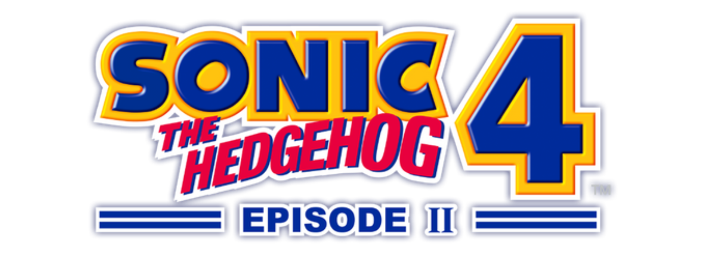

<h1 align=center>Sonic the Hedgehog 4: Episode II — Nintendo Switch port</h1>

This is a wrapper/port of the Android version of *Sonic the Hedgehog 4: Episode II* (`com.sega.sonic4ep2`, v3.0.0). It loads the original game binaries, patches them, and runs them: we natively run the original Android `.so` file inside a minimal emulated Android environment on the Nintendo Switch.

### How to Install

To play this game, you will need the **`.apk`** and **`.obb`** files for **version 3.0.0**.

From them, you need:
* **`lib/arm64-v8a/libfox.so`** — the game engine.
* The **entire `assets/` folder** from your `.apk` (containing the `.mp3` music, `.ogg` sound effects, and `.mp4` cutscenes).
* **`main.300...obb`** (usually named `main.30010.com.sega.sonic4ep2.obb` or similar depending on the version/store) — renamed to **`data.obb`**.

#### Setup Instructions:

1. Create a folder called `s4ep2` inside the `switch` folder on your SD card (i.e. `sdmc:/switch/s4ep2/`).
2. Create an `assets` folder inside the `s4ep2` folder (i.e. `sdmc:/switch/s4ep2/assets/`).
3. Extract **`lib/arm64-v8a/libfox.so`** from your `.apk` and copy it to `sdmc:/switch/s4ep2/libfox.so`.
4. Copy the **contents of the `assets/` folder** from your `.apk` (all the `.mp3`, `.ogg`, and `.mp4` files) into `sdmc:/switch/s4ep2/assets/`.
5. Copy the **`.obb`** file to `sdmc:/switch/s4ep2/assets/` and rename it to **`data.obb`** (so its path is `sdmc:/switch/s4ep2/assets/data.obb`).
6. Copy **`s4ep2_nx.nro`** into `sdmc:/switch/s4ep2/`.

### Notes

* This port **will not work** in applet mode (Album). Please launch homebrew menu using a game override (holding R button while booting any installed game) or a forwarder to give it full memory access and required syscalls.
* Save data (`foxsave_0.dat`), the game configuration, and `debug.log` are kept in `sdmc:/switch/s4ep2/`.
* The Episode 1 lock-on feature (Play as Metal Sonic in Episode 1 levels) is unlocked by default.

### Configuration

`config.txt` is created on first run:
* `screen_width` / `screen_height` — render resolution; `-1` automatically picks 1280x720 in handheld mode and 1920x1080 in docked mode.

### How to Build

You will need the `devkitA64` toolchain and the following `devkitPro` packages:
* `switch-mesa`
* `switch-libdrm_nouveau`
* `switch-sdl2`
* `switch-libpng`

Run `make` to compile.

### Credits

* [fgsfdsfgs](https://github.com/fgsfdsfgs) for [max_nx](https://github.com/fgsfdsfgs/max_nx) and [NaGaa95](https://github.com/NaGaa95) for [ct_nx](https://github.com/NaGaa95/ct_nx), which this loader is heavily based on.
* [TheOfficialFloW](https://github.com/TheOfficialFloW) for the original Vita ports that pioneered the Android `.so` loading technique.
* David Reid for [dr_mp3](https://github.com/mackron/dr_libs).
* Sean Barrett for [stb_vorbis](https://github.com/nothings/stb).

### Legal

This project has no direct affiliation with SEGA. "Sonic the Hedgehog" and "Sonic the Hedgehog 4: Episode II" are trademarks of their respective owners. All Rights Reserved.

No assets or program code from the original game are included in this repository. We do not condone piracy and encourage users to legally own the original game.

Unless specified otherwise, the source code provided in this repository is licensed under the MIT License. Please see the accompanying LICENSE file.
